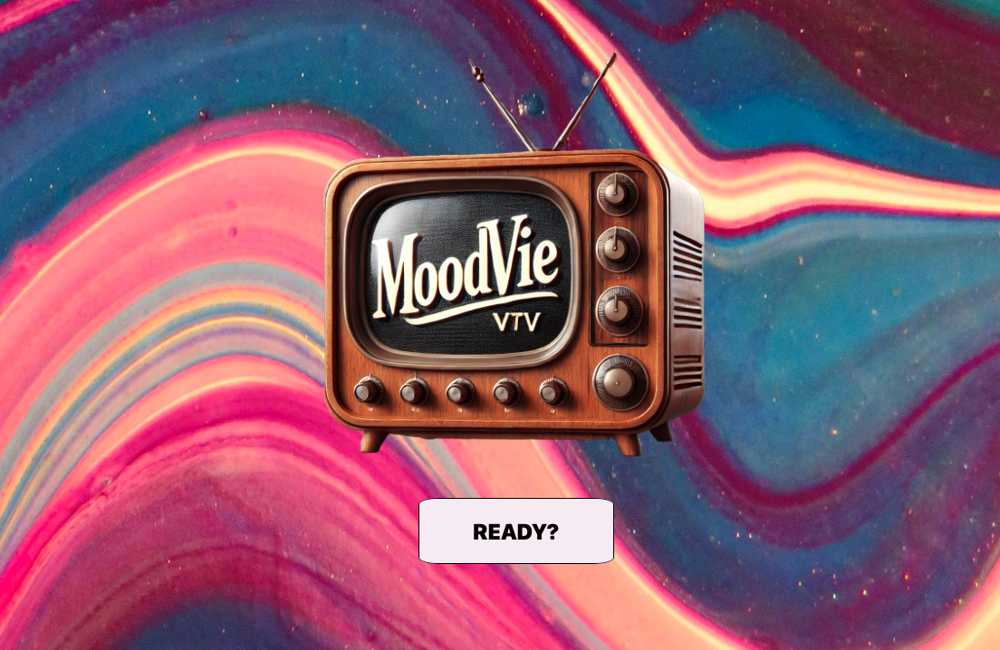

# Moodvie  

## Description:
Moodvie is a choose-your-own-adventure meets personalized movie generator game. When you don’t know what to watch next, Moodvie can help you find your new or old favorite flick. I love watching movies, so I was excited to find a way to incorporate some of my favorite characters into this project in a creative way. 

## How to Play:
1. Click "ready/start"
2. Pick your current moood
3. Choose from the prompts to find out what happens to your character and what movie best suits your mood.

# [Play](https://github.com/incogn-ito/moodvie.git)

[Planning Documents](https://docs.google.com/document/d/14sEc207wUQUH7VWI_DEM9FekjYFtgBQHSiLgz_-qOk4/edit?usp=sharing)

## Technologies Used:

## Acknowlegements:

[IMDb](Imdb.com) 

[ChatGPT4](chatGPT.com)

## Stretch Goals
1. Add audio
2. Add animation
3. Add links to trailers

